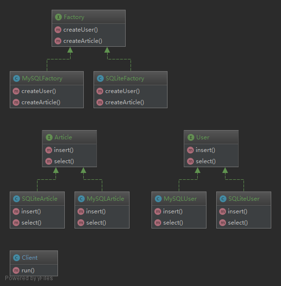
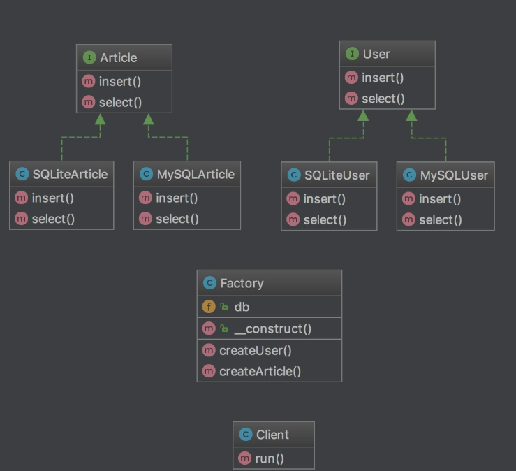

#### 抽象工厂模式

###### 概念
    为一个产品族提供了统一的创建接口。当需要这个产品族的某一系列的时候，可以为此系列的产品族创建一个具体的工厂类
    
    例如：
    工厂方法有个问题是每个工厂只生产一个产品；
    导致存在大量的工厂；
    类比我们现实中的工厂；
    生产牙刷造了一个牙刷厂；
    生成鞋刷又造了一个鞋刷厂；
    但是其实牙刷和鞋刷都属于刷子；
    这就是产品族的概念了；
    它们同属于一个产品族；
    我们只造一个刷子厂同时生产一个产品族下的牙刷和鞋刷即可；
    
###### 结构
    多个 interface 或者 abstract 产品父类；
    多个实现 interface 或者继承 abstract 的具体产品类；
    
    1个 interface 或者 abstract 工厂父类；
    1个实现 interface 或者继承 abstract 的具体工厂类；
    
    具体的工厂类里面有多个方法分别实例化具体的产品类；
    
###### 场景
    要实例话的对象充满不确定性可能会改变的时候；
    要创建的对象的数目和类型是未知的。

###### 分析
    抽象工厂的优点是产品跟客户端完全分离；
    我们在 Client 中只调用了 Factory；
    甚至连产品的类名都不需要知道；
    但是缺点也很明显；
    那如果要增加一个 category 表；
    那我们需要增加 Category接口类、MySQLCategory、SQLiteCategory；
    还需要在 Factory、MySQLFactory、SQLiteFactory 中增加 createCategory 方法；
    分别新增3个文件和改动3个文件才行。

 

----

###### 使用[反射优化抽象工厂](../AbstractFactoryWithReflection/index.php)
    多个 interface 或者 abstract 产品父类；
    多个实现 interface 或者继承 abstract 的具体产品类；
    
    1个工厂；
    工厂类里面有多个方法分别实例化不同的具体产品类；

优点：
    
    当我们需要支持更多的数据库的时候；
    比如说 PostgreSQL ；
    我们只需要新建 PostgreSQLUser 和 PostgreSQLArticle ；
    这就符合开闭原则了；
    可以方便的扩展且不需要修改 createUser 方法；

