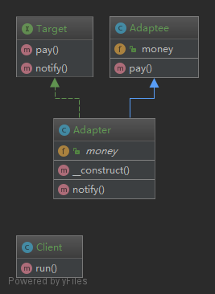

#### 适配器模式

###### 说明

    适配器模式还有一个名字叫包装器模式；
    就比如说手机充电器；
    墙上的插孔装修完后就不在变了；
    手机买回来后我们也不会去改造它；
    如何让不变的插孔和不变的手机之间能连上充电；
    并且把220V转换为5V；
    这时候就需要电源适配器了；
    软件开发中也是同样的道理；
    在软件中适配器分为类适配器和对象适配器

#### 类适配器

###### 结构

    Adaptee：原本已经有的具体类；
    Target：目标接口；包含我们希望拥有的方法；
    Adapter：适配器类；适配 Adaptee 和 Target；



#### 对象适配器

###### 类适配器缺点

    对象适配器和上篇的类适配器解决的问题一样；
    不过是适配器的另一种实现方式；
    示例中只有 Adapter 类有变化；
    Adaptee 和 Adapter 部分可以完全一样

###### 结构

    Adaptee：原本已经有的具体类；
    Target：目标接口；包含我们希望拥有的方法；
    Adapter：适配器类；适配 Adaptee 和 Target

- Adaptee.php

```php
<?php

namespace Mylafe\DesignPatterns\ClassAdapter;

/**
 * 源类
 */
class Adaptee
{
    /**
     * 金额
     *
     * @var string
     */
    public $money = '￥34';

    /**
     * 支付
     */
    public function pay()
    {
        echo '支付' . $this->money;
    }
}
```

- Target.php

```php
<?php

namespace Mylafe\DesignPatterns\ClassAdapter;

/**
 * 目标类接口
 */
interface Target
{
    /**
     * 支付
     */
    public function pay();

    /**
     * 通知
     */
    public function notify();
}
```

- Adapter.php

```php
<?php

namespace Mylafe\DesignPatterns\ObjectAdapter;

/**
 * 适配器
 */

class Adapter implements Target
{

    /**
     * Adapter constructor.
     */
    public function __construct(Adaptee $adaptee)
    {
        $this->adaptee = $adaptee;
        $adaptee->money = '$5';
    }

    /**
     * 支付
     */
    public function pay()
    {
        $this->adaptee->pay();
    }

    /**
     * 通知
     */
    public function notify()
    {
        echo '通知';
    }
}
```

- index.php

```php
<?php

require_once 'Adaptee.php';
require_once 'Target.php';
require_once 'Adapter.php';

use Mylafe\DesignPatterns\ObjectAdapter;

/**
 * 客户端
 *
 * Class Client
 * @package Baijunyao\DesignPatterns\ObjectAdapter
 */
class Client
{
    /**
     * 运行
     */
    public function run()
    {
        // 原本的类的
        $adaptee = new ObjectAdapter\Adaptee();
        $adaptee->pay();
        echo '<br>';

        // 适配器
        $adapter = new ObjectAdapter\Adapter($adaptee);
        $adapter->pay();
        echo '<br>';

        $adapter->notify();
    }
}

$client = new Client();
$client->run();
```

    通过适配后；
    我们可以在不改变原本的 Adaptee 类的情况下改变支付的币种；
    并且可以灵活的增加新的方法；
    相比类适配器；
    对象适配器不需要继承；
    因此也更加灵活一些
