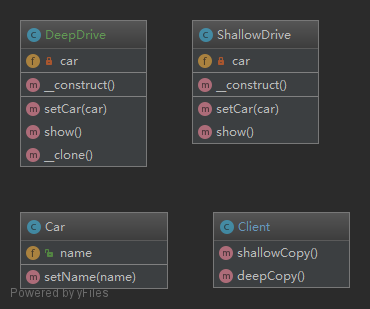

#### 原型模式

#### 概念

原型模式是先创建好一个原型对象，然后通过clone原型对象来创建新的对象。适用于大对象的创建，因为创建一个大对象需要很大的开销，如果每次new就会消耗很大，原型模式仅需内存拷贝即可。

    原型模式主要用于创建重复的对象；
    目的是使用 clone 对象来减少 new 对象的开销；
    如果某个场景需要多次实例化一个类；
    那就可以尝试用原型模式优化；
    在 php 中使用原型模式是很简单的；
    毕竟 php 是世界上最好的语言；
    我们只需要 clone 就行了；
    但是 clone 有一些问题；

#### 结构

    抽象的 __clone() 方法；

#### 深拷贝和浅拷贝

浅拷贝：被拷贝对象的所有变量都含有与原对象相同的值，而且对其他对象的引用仍然是指向原来的对象，即浅拷贝只负责当前对象实例，对引用的对象不做拷贝。

深拷贝：被拷贝对象的所有的变量都含有与原来对象相同的值，除了那些引用其他对象的变量，那些引用其他对象的变量将指向一个被拷贝的新对象，而不再是原来那些被引用的对象。即深拷贝把要拷贝的对象所引用的对象也拷贝了一次。而这种对被引用到的对象拷贝叫做间接拷贝。

