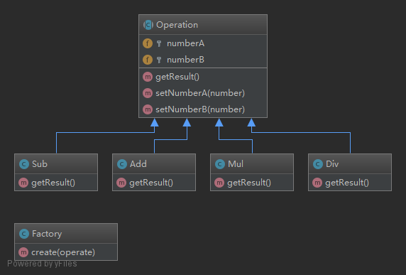

#### 简单工厂模式

###### 概念
    定义一个工厂类，他可以根据参数的不同返回不同类的实例，被创建的实例通常都具有共同的父类
    
###### 结构
    一个工厂类：用以实例化对象
    一个抽象基类(interface 或者 abstract 产品父类)：类中定义抽象一些方法，用以在子类中实现
    继承自抽象基类的子类(多个实现 interface 或者继承 abstract 的具体产品类)：实现基类中的抽象方法
    
###### 场景
    不确定存在多少种操作类型时候。比如：支付方式、运算符
 
 ###### 模式
    抽象基类：类中定义抽象一些方法，用以在子类中实现
    继承自抽象基类的子类：实现基类中的抽象方法
    工厂类：用以实例化对象

