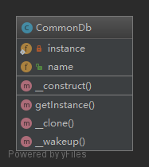

#### 单例模式
###### 概念
    一个类只允许创建一个实例
    
###### 场景
    一些比较消耗资源的操作，比如：数据库链接
    
###### 结构
    4私1公；
    私有化静态属性：防止直接访问存储实例的属性；
    私有化构造方法：防止使用new创建多个实例；
    私有化克隆方法：防止clone多个实例；
    私有化重建方法：防止反序列化；
    公有化静态方法：入口
    


```` php
<?php
namespace Mylafe\DesignPatterns\Singleton;

/**
 * 单例模式
 */
class CommonDb
{
    public $name;
    //存放实例-私有静态变量
    private static $instance = null;

    //公有化获取实例方法
    public static function getInstance()
    {
        if (null === static::$instance) {
            static::$instance = new static();
        }
        return static::$instance;
    }

    /**
     * 防止使用new创建多个实例
     */
    private function __construct()
    {

    }

    /**
     * 防止clone多个实例
     */
    private function __clone()
    {

    }

    /**
     * 防止反序列化
     */
    private function __wakeup()
    {

    }
}
````
----
```` php
<?php
require_once 'patterns.php';
use Mylafe\DesignPatterns\Singleton;

$db1 = Singleton\CommonDb::getInstance();
$db1->name = 'demo';
$db2 =  Singleton\CommonDb::getInstance();
$db2->name = 'demo2';

var_dump($db1->name);
var_dump($db2->name);
````
    结果：
    D:\Program Files (x86)\Ampps\www\github\design-patterns-php\Singleton\index.php:10:string 'demo2' (length=5)
    D:\Program Files (x86)\Ampps\www\github\design-patterns-php\Singleton\index.php:11:string 'demo2' (length=5)
